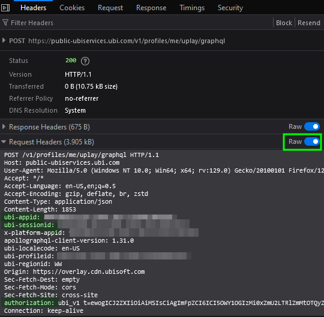

# R6 MarketSnipe

This tool can be used to buy a certain item for cheap, also called sniping. 

Don't hesitate to create issues to ask for more functionalities.

## Usage

- Create a .env file like this
```
AUTH_TOKEN = ""
SESSION_ID = ""
APP_ID = ""
```

### Find the variable values 

- Go to the [Rainbow6 Markeplace](https://www.ubisoft.com/en-us/game/rainbow-six/siege/marketplace?route=home)
- Open the network dev tools
- Navigate to either the Buy, Sell, or My Transactions
- You'll get a POST request with every values you need in the **raw** requests headers :
    - ubi-appid: <APP_ID>
    - ubi-sessionid: <SESSION_ID>
    - authorization: ubi_v1 t=<AUTH_TOKEN>



### Example :

`python3 main.py "https://www.ubisoft.com/fr-fr/game/rainbow-six/siege/marketplace?route=sell%2Fitem-details&itemId=a1f831aa-b6fd-08ce-13e9-45ab2397d998"`